# Cloud Atlas - Monolith to Microservices & CI/CD on AWS

[](https://aws.amazon.com/)
[](https://aws.amazon.com/codepipeline/)
[-blue)](https://aws.amazon.com/architecture/)
[](https://www.docker.com/)
[-4479A1?logo=mysql&logoColor=white)](https://aws.amazon.com/rds/)
[](LICENSE)

---

## Executive Summary

**Cloud Atlas** is an end-to-end cloud modernization project demonstrating the transformation of an on-premises/single-instance monolithic Node.js web application into a highly available, decoupled, and secure microservices architecture deployed on **Amazon Web Services (AWS)**.

Prior to modernization, the coffee supplier application suffered from classical monolithic pitfalls:
- **Single Point of Failure (SPOF)**: The entire web interface, admin backend, and business logic ran on a single EC2 host.
- **Resource Contention**: High-frequency read queries from café managers directly degraded administrative operations.
- **Risky Deployments**: Any code modification or update required restarting the monolithic daemon, causing complete service downtime.
- **Coarse Security**: Administrative routes (`/admin/suppliers`) and public browsing shared the same networking boundaries without perimeter IP filtering.

### Modernization Highlights
- **Decoupled Microservices**: Split the monolith into two purpose-built microservices:
  1. **Customer Microservice**: A lightweight, read-only catalog on port 8080 optimized for high-volume customer traffic.
  2. **Employee Microservice**: An administrative read-write service with full CRUD capabilities.
- **Serverless Container Compute**: Migrated application execution to **AWS Fargate** inside an **Amazon ECS** cluster (`microservices-serverlesscluster`), eliminating EC2 server management, patching, and provisioning overhead.
- **Intelligent Ingress & Routing**: Implemented an **Application Load Balancer (ALB)** with path-based routing rules directing `/admin/*` traffic to the Employee microservice and all other traffic to the Customer microservice.
- **Zero-Downtime Blue/Green CI/CD**: Automated deployment workflows with **AWS CodePipeline** and **AWS CodeDeploy**. Using 4 independent Target Groups, new container revisions are deployed to a green environment, tested, and shifted seamlessly to production without dropping connections.
- **Defense-in-Depth Security**: Implemented CIDR-based source IP whitelisting on the ALB HTTP:80 listener, allowing only authorized corporate network IPs access to administrative capabilities while rendering a 404 response to unauthorized external devices.
- **Independent Elasticity**: Demonstrated isolated auto-scaling by increasing the Customer microservice capacity to 3 tasks without affecting the Employee microservice.

---

## System Architecture

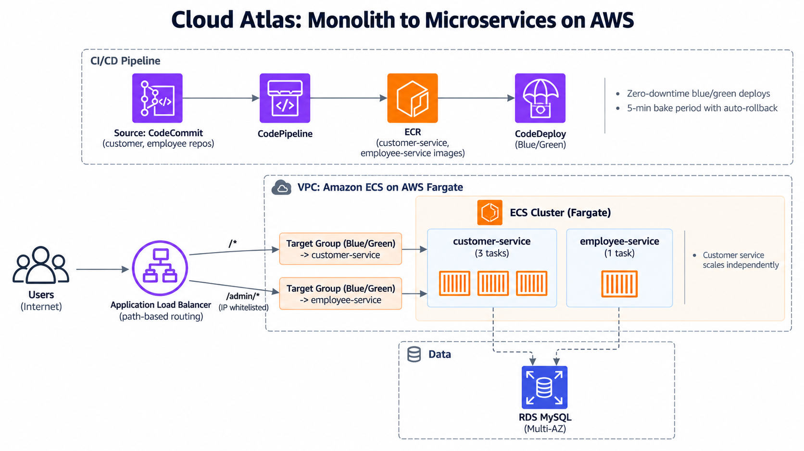

*Detailed resource-level view:*

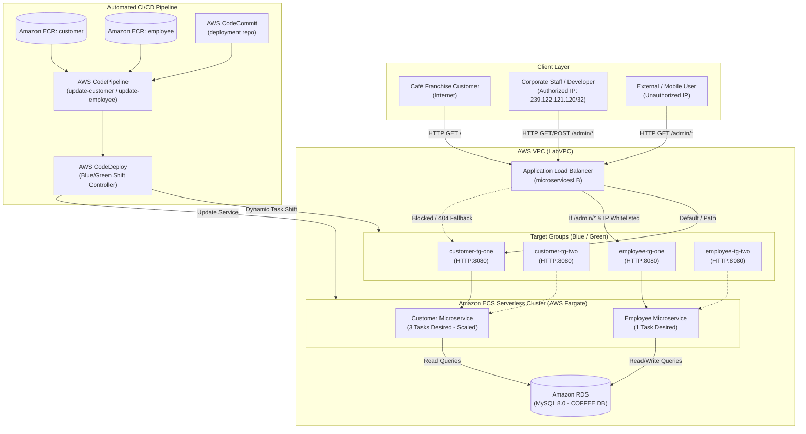
```mermaid
graph TD
    subgraph Users ["Client Layer"]
        CustomerUser["Café Franchise Customer<br/>(Internet)"]
        CorporateUser["Corporate Staff / Developer<br/>(Authorized IP: 239.122.121.120/32)"]
        UnauthorizedUser["External / Mobile User<br/>(Unauthorized IP)"]
    end

    subgraph Networking ["AWS VPC (LabVPC)"]
        ALB["Application Load Balancer<br/>(microservicesLB)"]
        
        subgraph TargetGroups ["Target Groups (Blue / Green)"]
            CustTG1["customer-tg-one<br/>(HTTP:8080)"]
            CustTG2["customer-tg-two<br/>(HTTP:8080)"]
            EmpTG1["employee-tg-one<br/>(HTTP:8080)"]
            EmpTG2["employee-tg-two<br/>(HTTP:8080)"]
        end

        subgraph ECSCluster ["Amazon ECS Serverless Cluster (AWS Fargate)"]
            CustomerSvc["Customer Microservice<br/>(3 Tasks Desired - Scaled)"]
            EmployeeSvc["Employee Microservice<br/>(1 Task Desired)"]
        end

        RDS[("Amazon RDS<br/>(MySQL 8.0 - COFFEE DB)")]
    end

    subgraph CICD ["Automated CI/CD Pipeline"]
        ECR_Cust[("Amazon ECR: customer")]
        ECR_Emp[("Amazon ECR: employee")]
        CodeCommit["AWS CodeCommit<br/>(deployment repo)"]
        CodePipeline["AWS CodePipeline<br/>(update-customer / update-employee)"]
        CodeDeploy["AWS CodeDeploy<br/>(Blue/Green Shift Controller)"]
    end

    CustomerUser -->|HTTP GET /| ALB
    CorporateUser -->|HTTP GET/POST /admin/*| ALB
    UnauthorizedUser -->|HTTP GET /admin/*| ALB

    ALB -->|Default / Path| CustTG1
    ALB -->|If /admin/* & IP Whitelisted| EmpTG1
    ALB -.->|Blocked / 404 Fallback| CustTG1

    CustTG1 --> CustomerSvc
    CustTG2 -.-> CustomerSvc
    EmpTG1 --> EmployeeSvc
    EmpTG2 -.-> EmployeeSvc

    CustomerSvc -->|Read Queries| RDS
    EmployeeSvc -->|Read/Write Queries| RDS

    ECR_Cust --> CodePipeline
    ECR_Emp --> CodePipeline
    CodeCommit --> CodePipeline
    CodePipeline --> CodeDeploy
    CodeDeploy -->|Dynamic Task Shift| TargetGroups
    CodeDeploy -->|Update Service| ECSCluster
```

---

## Phase 1: Planning & Cost Estimation

Before provisioning cloud infrastructure, a full 12-month Total Cost of Ownership (TCO) estimate was modeled using the **AWS Pricing Calculator** for the `us-east-1` (N. Virginia) region.

### 12-Month Total Cost Breakdown: **$1,745.52 USD** ($145.46 / month)

| AWS Service | Workload Description & Sizing | Monthly Cost (USD) | 12-Month Cost (USD) |
| :--- | :--- | :--- | :--- |
| **Amazon RDS for MySQL** | Single-AZ `db.t3.medium`, 20 GB gp2 SSD storage, Automated Backups | $69.57 | $834.84 |
| **AWS Fargate** | 2 Tasks (Customer & Employee), 0.5 vCPU, 1 GB RAM each, 24/7 runtime | $36.04 | $432.48 |
| **Elastic Load Balancing** | 1 Application Load Balancer (ALB), 2 Listeners, Path Routing & LCU usage | $22.27 | $267.24 |
| **Amazon EC2** | 1 x `t3.small` instance for AWS Cloud9 development IDE | $15.18 | $182.16 |
| **AWS CodePipeline** | 2 Active pipelines (`update-customer`, `update-employee`) | $1.00 | $12.00 |
| **AWS CodeDeploy** | Blue/Green deployments for ECS Fargate | $0.80 | $9.60 |
| **Amazon CloudWatch** | CloudWatch Logs (`awslogs-capstone` log group), metrics collection | $0.50 | $6.00 |
| **Amazon ECR** | 1 GB storage for container images (`customer:latest`, `employee:latest`) | $0.10 | $1.20 |
| **Total** | **Comprehensive Solution Architecture** | **$145.46** | **$1,745.52** |

<p align="center">
  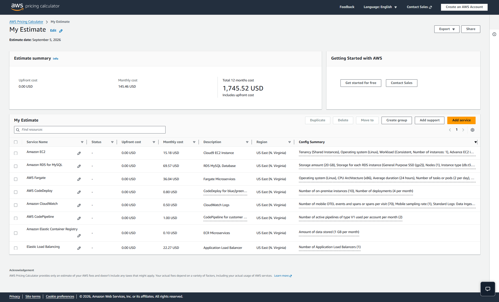
  <br/><em>Figure 1.1: AWS Pricing Calculator official cost estimation summary.</em>
</p>

*Complete cost estimate document available at [docs/screenshots/phase-01-planning-and-cost/task-1.2-cost-estimate-report.pdf](docs/screenshots/phase-01-planning-and-cost/task-1.2-cost-estimate-report.pdf).*

---

## Phase 2: Analyzing the Monolithic Infrastructure

To understand the existing architecture, the baseline monolithic deployment was investigated:
1. **EC2 Verification**: Verified `MonolithicAppServer` (`t2.micro` running Ubuntu 20.04 LTS at public IP `54.197.115.40`).
2. **Application Testing**: Validated the web application at `/suppliers`, tested adding records via `/supplier-add`, and inspected route behaviors.
3. **Internal Process Analysis**: Connected via **EC2 Instance Connect**, ran `lsof -i :80` and `ps -ef | grep node` to verify that Node.js was bound directly to privileged port 80.
4. **Database Verification**: Verified network connectivity from the EC2 instance to Amazon RDS on port 3306 using `nmap -Pn` and queried the `COFFEE.suppliers` table via the `mysql` CLI client.

<p align="center">
  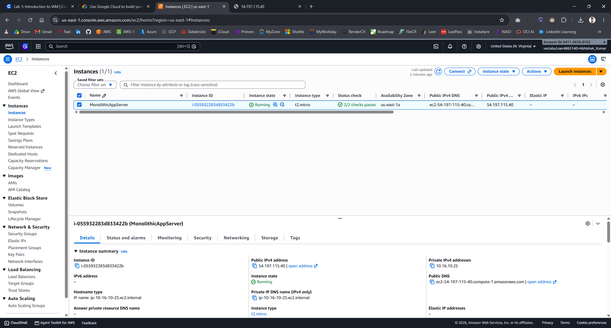
  <br/><em>Figure 2.1: Legacy MonolithicAppServer EC2 instance running in LabVPC.</em>
</p>

<p align="center">
  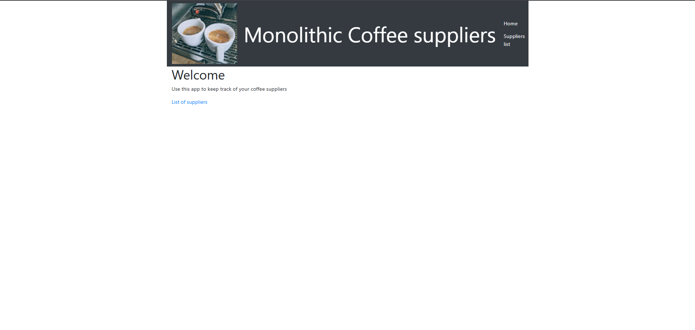
  <br/><em>Figure 2.2: Legacy Monolithic Coffee Suppliers landing page.</em>
</p>

<p align="center">
  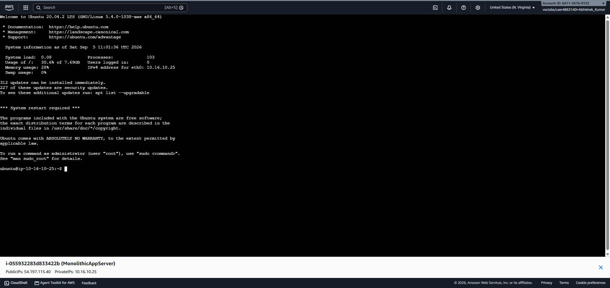
  <br/><em>Figure 2.3: SSH session through EC2 Instance Connect inspecting the monolithic node daemon.</em>
</p>

---

## Phase 3: Cloud Development Environment (AWS Cloud9)

An **AWS Cloud9** cloud-native IDE (`MicroservicesIDE`, running on an Amazon Linux 2 `t3.small` instance in `Public Subnet1`) was provisioned to serve as the unified containerization, build, and Git workspace.

The monolithic codebase was cloned and partitioned into two clean microservice working directories: `customer/` and `employee/`. A Git repository was initialized with a `dev` branch and pushed to **AWS CodeCommit** (`microservices` repository).

<p align="center">
  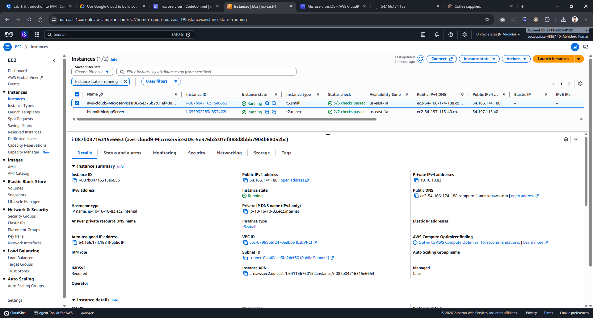
  <br/><em>Figure 3.1: Cloud9 MicroservicesIDE running on EC2 in LabVPC Public Subnet1.</em>
</p>

---

## Phase 4: Microservice Decomposition & Containerization

### 1. Codebase Refactoring
- **Customer Microservice (`customer/`)**:
  - Removed write routes (`supplier-add`, `supplier-update`, `supplier-delete`).
  - Retained read-only methods (`Supplier.getAll` and `Supplier.findById`).
  - Added an "Administrator link" (`/admin/suppliers`) in `nav.html` for navigation.
  - Adjusted listen port to environment-driven port 8080.
- **Employee Microservice (`employee/`)**:
  - Prepended `/admin` to all application routes (`/admin/suppliers`, `/admin/supplier-add`, `/admin/supplier-update/:id`, `/admin/supplier-delete/:id`).
  - Added full CRUD controllers and forms with CSRF/validation handling.
  - Updated navbar to feature "Manage coffee suppliers".

### 2. Dockerization & Local Verification
Both services were packaged with lightweight `node:11-alpine` base images:
```dockerfile
FROM node:11-alpine
RUN mkdir -p /usr/src/app
WORKDIR /usr/src/app
COPY . .
RUN npm install
EXPOSE 8080
CMD ["npm", "run", "start"]
```

During local test container execution on Cloud9:
- `customer_1` was tested on port 8080 (`http://<Cloud9-IP>:8080/suppliers`).
- `employee_1` was tested on port 8081 (`http://<Cloud9-IP>:8081/admin/suppliers`).
- Successfully verified CRUD operations, RDS MySQL connectivity, and database persistence.
- Re-tagged both microservices to port 8080 for production deployment.

<p align="center">
  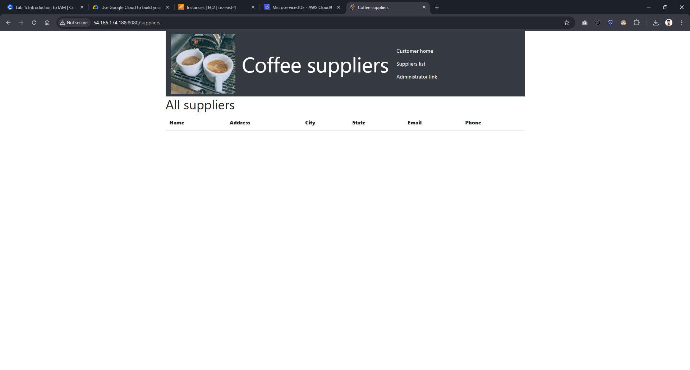
  <br/><em>Figure 4.1: Customer read-only microservice running in a Docker container on port 8080.</em>
</p>

<p align="center">
  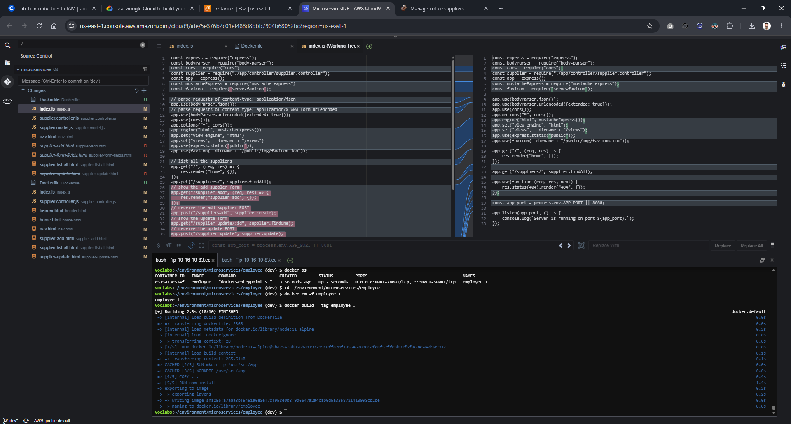
  <br/><em>Figure 4.2: Cloud9 IDE code diff inspection and Docker container image build.</em>
</p>


---

## Phase 5: Amazon ECR, ECS Cluster & Task Specifications

### 1. Amazon Elastic Container Registry (ECR)
Created two private ECR repositories: `customer` and `employee`. Docker clients were authenticated via AWS CLI credential helpers, and images were tagged and pushed:
```bash
docker tag customer:latest $ACCOUNT_ID.dkr.ecr.us-east-1.amazonaws.com/customer:latest
docker push $ACCOUNT_ID.dkr.ecr.us-east-1.amazonaws.com/customer:latest
```

<p align="center">
  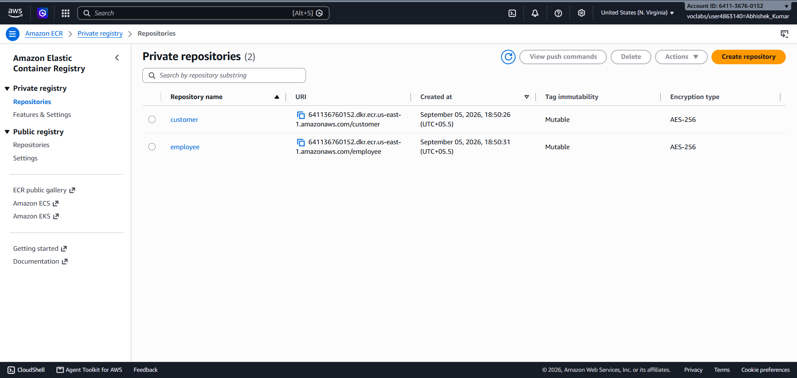
  <br/><em>Figure 5.1: Private Amazon ECR repositories for customer and employee microservices.</em>
</p>

### 2. Amazon ECS Serverless Cluster (AWS Fargate)
Created an ECS cluster named `microservices-serverlesscluster` using **AWS Fargate (serverless)** compute capacity across `Public Subnet1` and `Public Subnet2`.

<p align="center">
  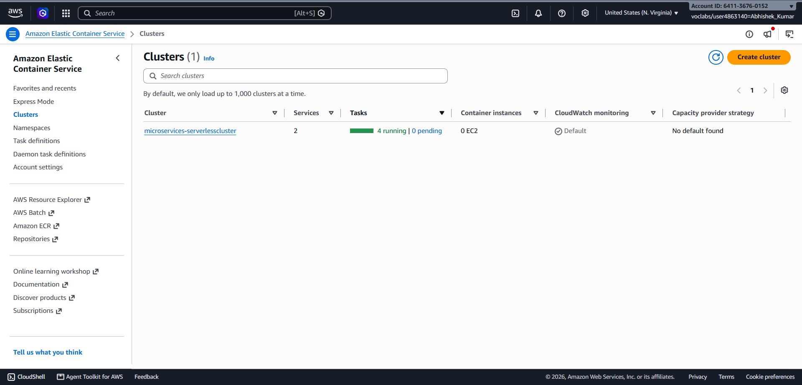
  <br/><em>Figure 5.2: Active Amazon ECS Serverless cluster on AWS Fargate.</em>
</p>

### 3. Task Definitions & AppSpec Files
Registered Amazon ECS Task Definitions using `awsvpc` network mode, allocating `0.5 vCPU (512)` and `1 GB RAM (1024)` per task, configured with AWS CloudWatch Logs driver (`awslogs-capstone`). Configured dynamic placeholder `<IMAGE1_NAME>` in `taskdef-customer.json` and `taskdef-employee.json` to allow automated image swapping during CI/CD.

Authored CodeDeploy `appspec-customer.yaml` and `appspec-employee.yaml` referencing dynamic `<TASK_DEFINITION>` revisions.

<p align="center">
  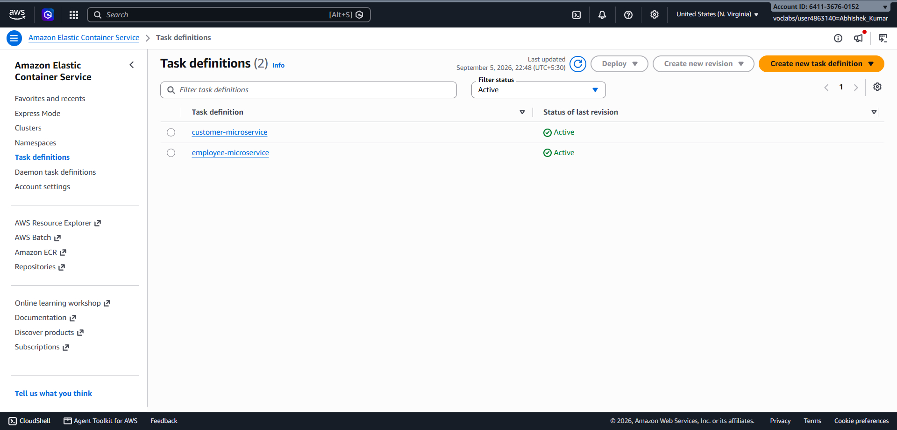
  <br/><em>Figure 5.3: Registered Amazon ECS Task Definitions with revision tracking.</em>
</p>

---

## Phase 6: Application Load Balancer & Target Groups

To enable Blue/Green deployment and path routing, **four Target Groups** were created (target type: `IP`, protocol: `HTTP:8080`):
1. `customer-tg-one` (Production Blue)
2. `customer-tg-two` (Replacement Green)
3. `employee-tg-one` (Production Blue)
4. `employee-tg-two` (Replacement Green)

An internet-facing **Application Load Balancer** (`microservicesLB`) was deployed with two listeners:
- **HTTP:80 (Production Traffic)**: Default rule forwards to `customer-tg-one`; path rule `IF Path is /admin/* THEN Forward to employee-tg-one`.
- **HTTP:8080 (Test Traffic)**: Forwards replacement task sets during deployments for pre-traffic-shift validation.

<p align="center">
  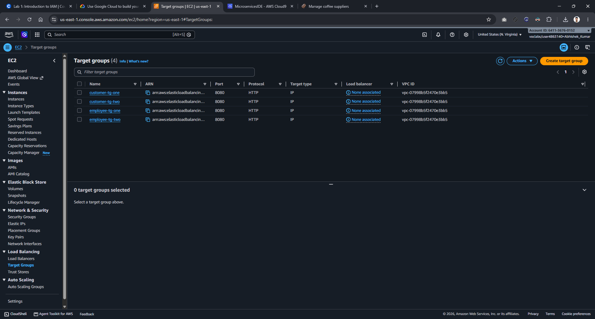
  <br/><em>Figure 6.1: The 4 Target Groups configured to support Blue/Green traffic shifting.</em>
</p>

<p align="center">
  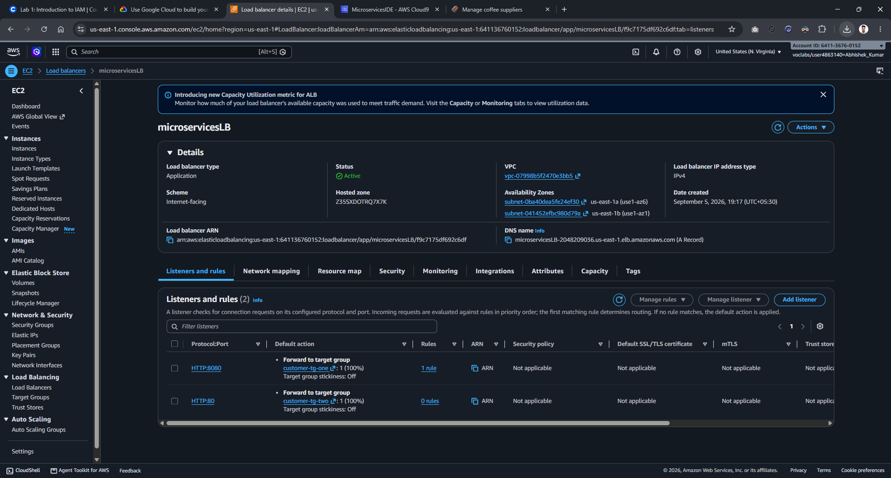
  <br/><em>Figure 6.2: Active Application Load Balancer (microservicesLB) with multi-port listeners.</em>
</p>

---

## Phase 7 & 8: Zero-Downtime Blue/Green CI/CD Pipeline

### 1. CodeDeploy & ECS Service Creation
Two ECS services (`customer-microservice` and `employee-microservice`) were provisioned with the `CODE_DEPLOY` deployment controller. In AWS CodeDeploy, application `microservices` and two deployment groups (`microservices-customer` and `microservices-employee`) were created with:
- **Deployment Configuration**: `CodeDeployDefault.ECSAllAtOnce`
- **Traffic Rerouting**: Immediate reroute after health checks pass
- **Original Revision Termination**: 5-minute bake time for seamless rollback capability

<p align="center">
  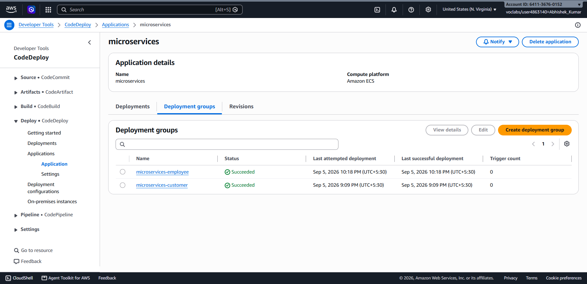
  <br/><em>Figure 8.1: CodeDeploy application and deployment groups configured for ECS Blue/Green.</em>
</p>

### 2. Multi-Source CodePipeline Construction
Built two automated pipelines in **AWS CodePipeline**:
1. `update-customer-microservice`
2. `update-employee-microservice`

Each pipeline listens to **two simultaneous source triggers**:
- **Source 1 (AWS CodeCommit)**: Repository `deployment` (branch `dev`) delivering task definitions and AppSpec files.
- **Source 2 (Amazon ECR)**: Dynamic container image updates tagged `latest`.

During the Deploy stage, CodePipeline substitutes `<IMAGE1_NAME>` with the exact ECR image digest from the Source stage and hands deployment execution to AWS CodeDeploy.

<p align="center">
  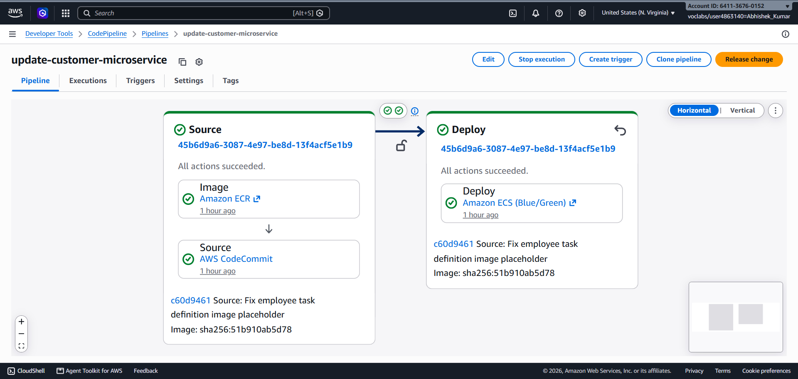
  <br/><em>Figure 8.2: CodePipeline update-customer-microservice executing zero-downtime Blue/Green deployment.</em>
</p>

<p align="center">
  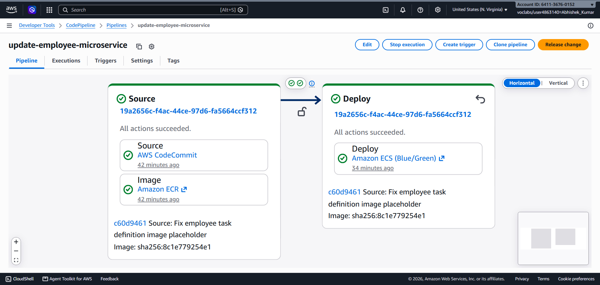
  <br/><em>Figure 8.3: CodePipeline update-employee-microservice successfully deploying to ECS Fargate.</em>
</p>

<p align="center">
  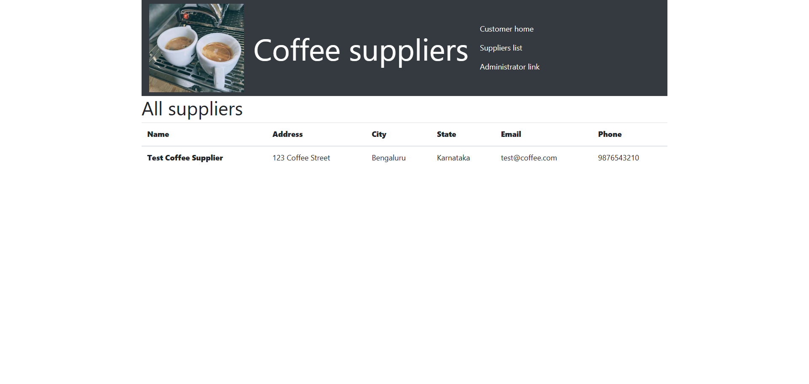
  <br/><em>Figure 8.4: Live Customer Microservice in production accessible via the ALB DNS endpoint.</em>
</p>

<p align="center">
  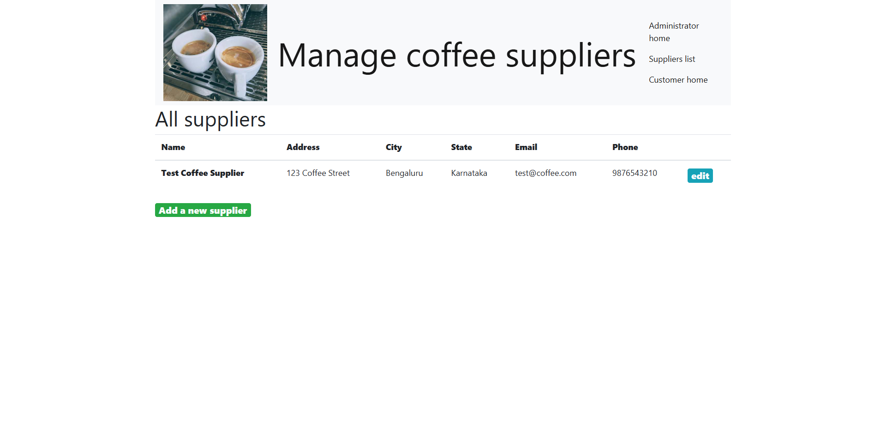
  <br/><em>Figure 8.5: Live Employee Microservice in production accessible via ALB path routing (/admin/suppliers).</em>
</p>

---

## Phase 9: Security Whitelisting, UI Iteration & Scaling

### 1. Granular ALB Source IP Whitelisting
To prevent unauthorized access to sensitive employee administration pages, the ALB HTTP:80 and HTTP:8080 listener rules were updated with composite conditions:
- **Condition**: `IF Path is /admin/* AND Source IP is 239.122.121.120/32`
- **Action**: Forward to `employee-tg-one`

<p align="center">
  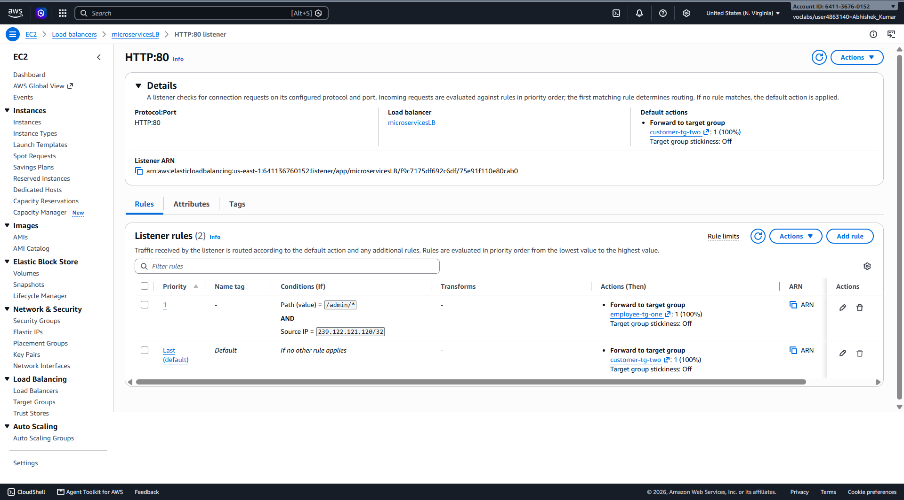
  <br/><em>Figure 9.1: Application Load Balancer path and CIDR IP whitelisting rule configuration.</em>
</p>

### 2. Automated Pipeline Trigger via ECR Image Push
The Employee microservice UI was updated from a dark navigation banner (`navbar-dark bg-dark`) to a light navbar (`navbar-light bg-light`). The new image was built, tagged, and pushed to Amazon ECR. 

CodePipeline immediately detected the new ECR digest, triggered `update-employee-microservice`, and deployed the UI update without manual intervention.

<p align="center">
  
  <br/><em>Figure 9.2: Updated Employee microservice UI featuring the light theme deployed automatically via CI/CD.</em>
</p>

### 3. Security Verification: External IP Access Blocked
Testing access from an external cellular network device (`153.247.86.114`) verified that non-whitelisted IPs navigating to `/admin/*` are blocked from accessing administrative functions and gracefully served a 404 response page ("Sorry, we don't seem to have that page in stock"), confirming strict security perimeter enforcement.

<p align="center">
  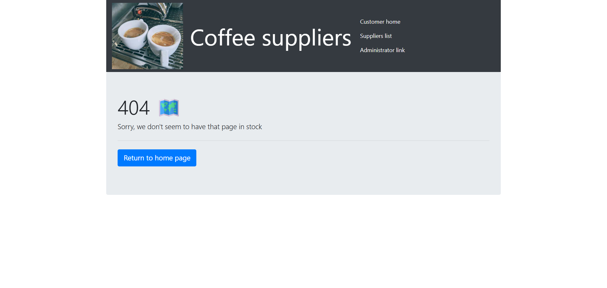
  <br/><em>Figure 9.3: Security perimeter test: unauthorized external mobile client receives 404 response on /admin/*.</em>
</p>

### 4. Independent Microservice Scaling
Demonstrated independent horizontal scalability by scaling the `customer-microservice` from 1 desired task to 3 desired tasks via the AWS CLI:
```bash
aws ecs update-service   --cluster microservices-serverlesscluster   --service customer-microservice   --desired-count 3
```
The Customer microservice instantly scaled across multiple availability zones on AWS Fargate without requiring changes to the Employee microservice or triggering the CI/CD pipeline.

---

## Repository Structure

```text
.
├── services/
│   ├── customer-microservice/
│   │   ├── Dockerfile
│   │   ├── package.json
│   │   ├── index.js
│   │   ├── app/
│   │   │   ├── config/config.js
│   │   │   ├── controller/
│   │   │   └── models/
│   │   └── views/
│   └── employee-microservice/
│       ├── Dockerfile
│       ├── package.json
│       ├── index.js
│       ├── app/
│       │   ├── config/config.js
│       │   ├── controller/
│       │   └── models/
│       └── views/
├── deployment/
│   ├── taskdef-customer.json
│   ├── taskdef-employee.json
│   ├── appspec-customer.yaml
│   ├── appspec-employee.yaml
│   ├── create-customer-microservice-tg-two.json
│   └── create-employee-microservice-tg-two.json
├── docs/
│   └── screenshots/
│       ├── phase-01-planning-and-cost/
│       ├── phase-02-monolith-analysis/
│       ├── phase-03-cloud9-dev-env/
│       ├── phase-04-docker-microservices/
│       ├── phase-05-ecr-ecs-fargate/
│       ├── phase-06-alb-routing/
│       ├── phase-07-ecs-services/
│       ├── phase-08-cicd-blue-green/
│       └── phase-09-ip-restriction-updates/
├── .gitignore
├── LICENSE
└── README.md
```

---

## How to Run Locally

### Prerequisites
- Docker Engine 20.10+
- Node.js 14+ (optional, for running outside containers)
- Running MySQL instance or container

### 1. Build and Run Customer Microservice
```bash
cd services/customer-microservice
docker build -t customer:latest .
docker run -d --name customer -p 8080:8080   -e APP_DB_HOST="localhost"   -e APP_DB_USER="admin"   -e APP_DB_PASSWORD="password"   customer:latest
```
Access at: `http://localhost:8080/suppliers`

### 2. Build and Run Employee Microservice
```bash
cd services/employee-microservice
docker build -t employee:latest .
docker run -d --name employee -p 8081:8080   -e APP_DB_HOST="localhost"   -e APP_DB_USER="admin"   -e APP_DB_PASSWORD="password"   employee:latest
```
Access at: `http://localhost:8081/admin/suppliers`

---

## Key Takeaways & Architectural Competencies

1. **Cloud-Native Modernization**: Successfully decomposed a monolithic single-tier application into resilient, decoupled microservices.
2. **Serverless Containerization**: Leveraged AWS Fargate to achieve zero infrastructure management while maintaining autoscaling elasticity.
3. **Continuous Delivery**: Engineered robust CI/CD pipelines executing zero-downtime Blue/Green deployments with automated canary health validation.
4. **Defense-in-Depth Cloud Security**: Restricted sensitive endpoints using perimeter ALB listener rules and IP whitelisting without requiring complex application code changes.
5. **Cost Optimization**: Planned and executed an enterprise architecture modeled within budget limits ($145/month) using AWS Pricing Calculator.

---

## Author
**Abhishek Kumar**
- GitHub: [@isthatabbhi](https://github.com/isthatabbhi)
- Project: Cloud Atlas - Monolith to Microservices & CI/CD on AWS

